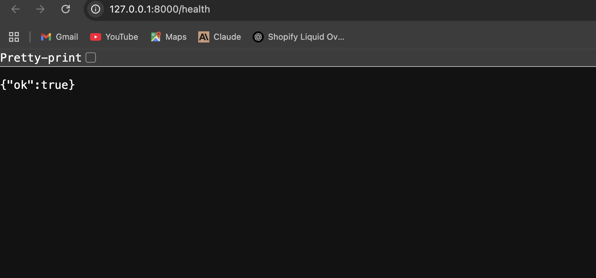
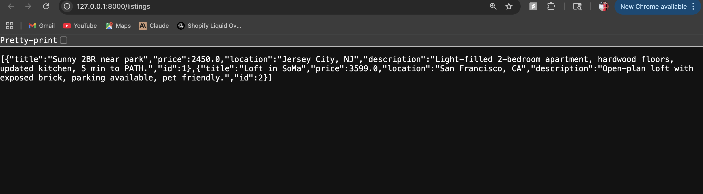
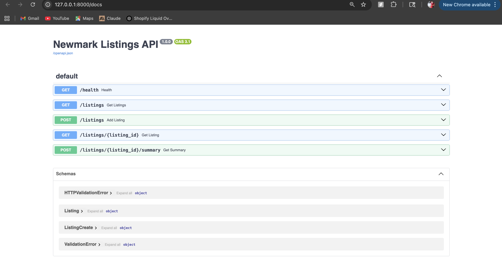
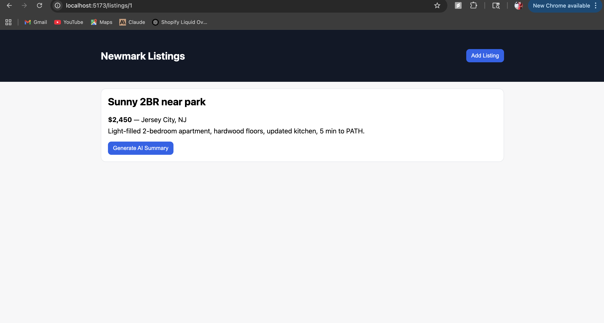

# 📒 AI Usage Log

This document explains where and how AI tools were used while building the **Newmark Listings App**.

---

## 🔹 Top 3–5 Prompt Snippets / Screenshots

### 1. Backend Scaffolding (FastAPI Endpoints)  
Prompt:  
*“Generate FastAPI endpoints for GET/POST listings and summary route with in-memory store.”*  
- AI created the base FastAPI scaffold (`/listings`, `/listings/{id}`, `/listings/{id}/summary`).  
- I customized it to ensure summaries always return exactly **3 bullet points**.  
- **Time saved:** ~1.5 hours.  

📎 Screenshot:  

---

### 2. Frontend Homepage + Search (React + Vite)  
Prompt:  
*“Scaffold React component for homepage with search bar and list of properties using Vite + TypeScript.”*  
- AI generated the homepage and state handling.  
- I added debounce logic and styles.  
- **Time saved:** ~1 hour.  

📎 Screenshot:  

---

### 3. Add Listing Form + Validation  
Prompt:  
*“Generate React form with validation for title, price, location, description.”*  
- AI scaffolded the Add Listing form.  
- I updated validation to enforce numeric-only `price`.  
- **Time saved:** ~30 minutes.  

📎 Screenshot:  

---

### 4. API Integration & Testing  
Prompt:  
*“Write one pytest happy-path test for create+fetch listing, and one edge case for 404.”*  
- AI created test skeletons.  
- I modified them to check summary length = 3 bullets.  
- **Time saved:** ~45 minutes.  

📎 Screenshots:  
  

---

### 5. Documentation (README Setup)  
Prompt:  
*“Generate step-by-step setup instructions for backend (FastAPI) and frontend (React Vite).”*  
- AI wrote installation and run instructions.  
- I added details for venv and port usage.  
- **Time saved:** ~45 minutes.  

📎 Screenshot:  

---

## 🔹 Example of AI Suggestion I Did NOT Use
- AI suggested implementing **SQLite migrations** with Alembic.  
- I skipped this to keep the project simple and within the 1–2 day timebox.  
- Instead, I stayed with an **in-memory store**, which is fine for demo purposes.

---

## 🔹 Estimated Time Saved
- Backend scaffolding → ~1.5 hours  
- Frontend scaffolding → ~1 hour  
- Form validation → ~30 minutes  
- Testing → ~45 minutes  
- Docs → ~45 minutes  

**➡️ Total saved: ~3.5–4.0 hours**

---

